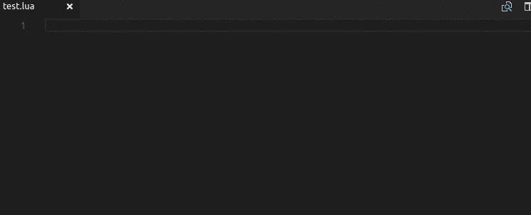

# Factorio Lua API autocomplete

Provides autocompletion for the Factorio Lua API

## Demo

## Features

- Autocomplete of all Lua classes and globals

## Roadmap

- Better support for functions that take tables as argument
- Function signature hints (**registerSignatureHelpProvider**)
- Hover tooltips (**registerHoverProvider**)
- Add autocomplete for [LuaControlBehavior](http://lua-api.factorio.com/latest/LuaControlBehavior.html) and [Events](http://lua-api.factorio.com/latest/events.html)

## [Change log](CHANGELOG.md)
