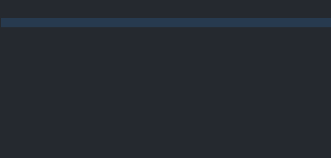

# Factorio API autocomplete extensions

## Features

- Autocomplete of all Lua classes and globals

  

- Documentation (toggle with Ctrl+Space between detailed and list view)

  

- Mouse hover tooltips

## Todo

- Better support for functions that take tables as argument
- Function signature hints (**registerSignatureHelpProvider**)
- Add autocomplete for [LuaControlBehavior](http://lua-api.factorio.com/latest/LuaControlBehavior.html)
- Provide direct links to the official API documentation in tooltips

## [Changelog](CHANGELOG.md)
