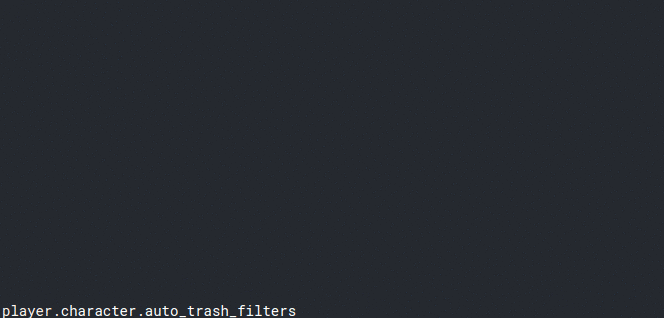

# Factorio API autocomplete extension

## Features

- Autocomplete of all Lua classes and globals

  

- Mouse hover tooltips, with links to the official documentation at http://lua-api.factorio.com

  

## Dev Requirements

Using nvm you can get the correct node version to run the scraper: `nvm use`.

After this install the necessary modules with `npm install`.

## Update data

Run the scrapper to pull the latest data from the Factorio API documentation: `npx ts-node scraper/index.ts`

## Todo

#### Features
- Better support for functions that take tables as argument
- Function signature hints (**registerSignatureHelpProvider**)

#### Technical tasks
- Instead of storing inherited properties in the data file, they should maybe get looked up during runtime
- Unit tests

## [Changelog](CHANGELOG.md)
